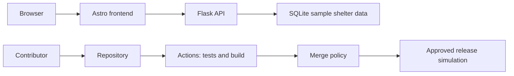

# 2. Plan the shelter's security checks

| [Previous: baseline](1-devops-baseline.md) | [Next: code scanning](3-code-scanning.md) |
|:---|---:|

Budget: 6 minutes. Your team is preparing a shelter release.

## Why it matters

A short threat model helps the team choose controls for specific failure scenarios and decide who handles their results.



The sketch shows the delivery path. The workshop does not deploy a hosted service, and the sample application has no learner authentication or customer-PII subsystem to include in the model.

## Try it

1. Discuss four questions: What are we building? What could go wrong? What will we do about it? How will we know?
2. In the Codespaces terminal, check `git status --short` and `git branch --show-current`. Use your existing `exercise/shelter-change` branch. In the editor, append the rows below to `workshop-notes.md` and fill in the missing controls and owners. Owners can be roles; do not publish private staff information.
3. Agree on an observable acceptance result for each row.

| Asset and risk | Control to complete | Owner to assign | Acceptance result |
|---|---|---|---|
| API process: direct startup enables a debugger | Safe default plus regression test | ___ | `debug=False` asserted and targeted CodeQL finding removed |
| Dependency change: introduces a vulnerable package | ___ | Maintainer | High-severity introduction fails review; repaired version passes |
| Repository history: contains a credential | Repository push protection and exposure response | ___ | Verified nonfunctional fixture blocked; clean retry succeeds |

Save the file, then record the notes on the same working PR:

```bash
git add -- workshop-notes.md
git diff --cached -- workshop-notes.md
git commit -m "Record the shelter threat model"
git push
```

If you need to switch branches, preserve any existing edits first; do not discard them. The [file-editor fallback](0-setup.md#fallback-b-github-file-editor) edits the same file on the same branch.

## Checkpoint

Your notes have three rows, each with a risk, control, and owner. You can explain what evidence would satisfy each row. The secret row remains incomplete until you observe a live block and clean retry; writing the criterion does not satisfy it.

## Resources

[OWASP threat modeling](https://owasp.org/www-community/Threat_Modeling) describes the four questions. [NIST SSDF](https://csrc.nist.gov/projects/ssdf) covers responsibilities across development and response.

| [Previous: baseline](1-devops-baseline.md) | [Next: code scanning](3-code-scanning.md) |
|:---|---:|
